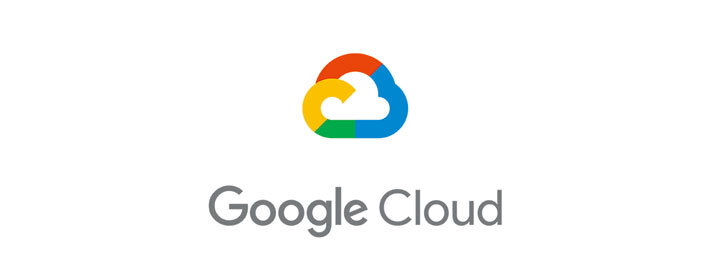
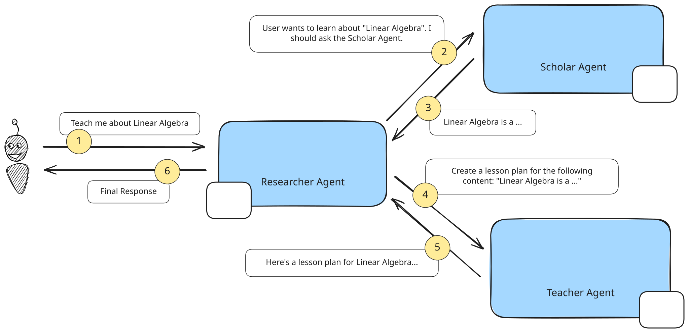

# Teaching Agents: A2A Protocol Demonstration

[](https://opensource.org/licenses/Apache-2.0)
[](https://www.python.org/downloads/)
[](https://github.com/google/agent-development-kit)

> **⚠️ DISCLAIMER: THIS IS NOT AN OFFICIALLY SUPPORTED GOOGLE PRODUCT. THIS PROJECT IS INTENDED FOR DEMONSTRATION PURPOSES ONLY. IT IS NOT INTENDED FOR USE IN A PRODUCTION ENVIRONMENT.**

<div align="center">
  
</div>

A comprehensive demonstration of Agent-to-Agent (A2A) protocol communication using Google's Agent Development Kit. This project showcases how a researcher agent can interact with multiple specialized remote agents (teacher and scholar) to provide enhanced research capabilities through distributed agent collaboration.

<div align="center">
  
</div>

## 📋 Table of Contents

- [Overview](#overview)
- [Architecture](#architecture)
- [Features](#features)
- [Prerequisites](#prerequisites)
- [Installation](#installation)
- [Usage](#usage)
  - [Running the Remote Agents](#running-the-remote-agents)
  - [Running the Researcher Agent](#running-the-researcher-agent)
- [API Documentation](#api-documentation)
- [Project Structure](#project-structure)
- [Configuration](#configuration)
- [Docker Deployment](#docker-deployment)
- [Troubleshooting](#troubleshooting)
- [Contributing](#contributing)
- [License](#license)
- [Learn More](#learn-more)

## 🎯 Overview

This demonstration implements the A2A (Agent-to-Agent) protocol to enable seamless communication between distributed AI agents. The system consists of:

- **Researcher Agent**: A central coordinator that processes user queries and delegates specialized tasks
- **Teacher Agent**: Specialized in educational content and instructional materials
- **Scholar Agent**: Focused on academic research and scholarly information

The agents communicate using standardized A2A protocol messages, enabling modular, scalable agent architectures where each agent can specialize in specific domains while collaborating effectively.

## 🏗️ Architecture

The system follows a distributed microservices architecture as shown in the diagram above. The key components work together to enable seamless agent-to-agent communication:

### Key Components

- **A2A Client**: Handles agent-to-agent communication protocol
- **Task Manager**: Manages distributed task execution and status tracking
- **Session Management**: Maintains conversation context across agent interactions
- **Authentication**: Secure agent-to-agent communication using API keys
- **Streaming Support**: Real-time updates for long-running tasks

## ✨ Features

- **🤖 Multi-Agent Collaboration**: Seamless coordination between specialized agents
- **🔄 Real-time Communication**: Streaming updates and live task status
- **🛡️ Secure Authentication**: API key-based agent authentication
- **📱 Modern Web UI**: Interactive Gradio interface for easy interaction
- **🐳 Docker Ready**: Containerized deployment for all agents
- **📊 Task Management**: Comprehensive task lifecycle management
- **🔧 Extensible**: Easy to add new agent types and capabilities
- **📝 Comprehensive Logging**: Detailed logging for debugging and monitoring

## 📋 Prerequisites

### System Requirements

- **Python**: 3.12 or higher
- **Operating System**: macOS, Linux, or Windows
- **Memory**: Minimum 4GB RAM recommended
- **Network**: Internet connection for Google Cloud services

### Google Cloud Setup

1. **Google Cloud Project**: Active GCP project with billing enabled
2. **Authentication**:
   ```bash
   gcloud auth application-default login
   ```
3. **Required APIs**:
   ```bash
   gcloud services enable aiplatform.googleapis.com
   ```

## 🚀 Installation

### 1. Clone the Repository

```bash
git clone <repository-url>
cd teaching-agents
```

### 2. Install UV Package Manager

UV is used for fast, reliable Python package management:

```bash
# Install UV
curl -LsSf https://astral.sh/uv/install.sh | sh

# Verify installation
uv --version
```

### 3. Setup Python Environment

```bash
# Install Python 3.12
uv python install 3.12

# Install project dependencies
uv sync --frozen
```

## 📖 Usage

### Running the Remote Agents

The remote agents must be started before the researcher agent. Each agent runs independently and can be deployed on different servers.

#### 1. Teacher Agent

```bash
# Navigate to teacher agent directory
cd remote_agents/teacher_agent

# Create and configure environment variables
cat > .env << 'EOF'
# Teacher Agent Configuration
API_KEY=your_secure_api_key_here
GCLOUD_LOCATION=us-central1
GCLOUD_PROJECT_ID=your-google-cloud-project-id
EOF

# Edit .env with your actual values
# Replace your_secure_api_key_here with a secure API key
# Replace your-google-cloud-project-id with your actual GCP project ID

# Install dependencies and run
uv sync --frozen
uv run .
```

The Teacher Agent will start on `http://localhost:10001`

#### 2. Scholar Agent

```bash
# Navigate to scholar agent directory
cd remote_agents/scholar_agent

# Create and configure environment variables
cat > .env << 'EOF'
# Scholar Agent Configuration
API_KEY=your_secure_api_key_here
GCLOUD_LOCATION=us-central1
GCLOUD_PROJECT_ID=your-google-cloud-project-id
EOF

# Edit .env with your actual values
# Replace your_secure_api_key_here with a secure API key (same as Teacher Agent)
# Replace your-google-cloud-project-id with your actual GCP project ID

# Install dependencies and run
uv sync --frozen
uv run .
```

The Scholar Agent will start on `http://localhost:10000`

### Running the Researcher Agent

Once both remote agents are running:

```bash
# Return to project root directory
cd ../..

# Create and configure environment variables
cat > researcher/.env << 'EOF'
# Researcher Agent Configuration
SCHOLAR_AGENT_AUTH=your_secure_api_key_here
SCHOLAR_AGENT_URL=http://localhost:10000
TEACHER_AGENT_AUTH=your_secure_api_key_here
TEACHER_AGENT_URL=http://localhost:10001
GOOGLE_GENAI_USE_VERTEXAI=TRUE
GOOGLE_CLOUD_PROJECT=your-google-cloud-project-id
GOOGLE_CLOUD_LOCATION=us-central1
EOF

# Edit researcher/.env with your actual values
# Replace your_secure_api_key_here with the same API key used for the remote agents
# Replace your-google-cloud-project-id with your actual GCP project ID

# Install dependencies and run
uv sync --frozen
uv run researcher_demo.py
```

The Researcher Agent UI will be available at `http://localhost:8080`

## 📚 API Documentation

### A2A Protocol Endpoints

Each remote agent exposes the following A2A protocol endpoints:

#### Send Task

```http
POST /a2a
Content-Type: application/json

{
  "jsonrpc": "2.0",
  "method": "tasks/send",
  "id": "unique-request-id",
  "params": {
    "id": "task-id",
    "sessionId": "session-id",
    "message": {
      "role": "user",
      "parts": [{"type": "text", "text": "Your query here"}],
      "metadata": {}
    },
    "acceptedOutputModes": ["text", "text/plain"]
  }
}
```

#### Task Status

```http
POST /a2a
Content-Type: application/json

{
  "jsonrpc": "2.0",
  "method": "tasks/get",
  "id": "unique-request-id",
  "params": {
    "taskId": "task-id"
  }
}
```

## 📁 Project Structure

```
teaching-agents/
├── README.md                    # This file
├── LICENSE                     # Apache 2.0 License
├── pyproject.toml              # Project configuration
├── uv.lock                     # Dependency lock file
├── teaching-agents.png         # Architecture diagram
├── researcher_demo.py          # Main demo script
├── a2a_types.py               # A2A protocol type definitions
│
├── researcher/                 # Main researcher agent
│   ├── agent.py               # Agent implementation
│   ├── researcher_agent.py    # Core researcher logic
│   ├── remote_agent_connection.py # A2A client connections
│   └── __init__.py            # Module initialization
│
├── remote_agents/             # Remote specialized agents
│   ├── teacher_agent/         # Teaching-focused agent
│   │   ├── agent.py          # Teacher agent implementation
│   │   ├── task_manager.py   # Task lifecycle management
│   │   ├── a2a_server/       # A2A protocol server
│   │   ├── pyproject.toml    # Agent-specific dependencies
│   │   └── Dockerfile        # Container configuration
│   │
│   └── scholar_agent/         # Research-focused agent
│       ├── agent.py          # Scholar agent implementation
│       ├── task_manager.py   # Task lifecycle management
│       ├── a2a_server/       # A2A protocol server
│       ├── pyproject.toml    # Agent-specific dependencies
│       └── Dockerfile        # Container configuration
│
└── a2a_client/                # A2A protocol client library
    ├── card_resolver.py      # Agent discovery and registration
    └── ...                   # Additional client utilities
```

## ⚙️ Configuration

### Environment Variables

#### Researcher Agent (`researcher/.env`)

```env
# Remote Agent Configuration - Must match API keys from remote agents
SCHOLAR_AGENT_AUTH=your_secure_api_key_here
SCHOLAR_AGENT_URL=http://localhost:10000
TEACHER_AGENT_AUTH=your_secure_api_key_here
TEACHER_AGENT_URL=http://localhost:10001

# Google Cloud Configuration
GOOGLE_GENAI_USE_VERTEXAI=TRUE
GOOGLE_CLOUD_PROJECT=your-google-cloud-project-id
GOOGLE_CLOUD_LOCATION=us-central1
```

#### Remote Agents (`.env` in each agent directory)

```env
# Authentication - Use the same secure API key for both agents
API_KEY=your_secure_api_key_here

# Google Cloud Configuration
GCLOUD_LOCATION=us-central1
GCLOUD_PROJECT_ID=your-google-cloud-project-id
```

### Port Configuration

- Researcher Agent UI: `8080`
- Scholar Agent: `10000`
- Teacher Agent: `10001`

### Security Notes

- **API Keys**: Use a strong, unique API key for agent authentication. The same key should be used across all agents for this demo.
- **Network Security**: The default configuration runs agents on localhost. For production deployment, implement proper network security and HTTPS.
- **Google Cloud**: Ensure your GCP project has the necessary APIs enabled and proper IAM permissions configured.

## 🐳 Docker Deployment

Each agent includes a Dockerfile for containerized deployment:

```bash
# Build and run Teacher Agent
cd remote_agents/teacher_agent
docker build -t teacher-agent .
docker run -p 10001:10001 --env-file .env teacher-agent

# Build and run Scholar Agent
cd ../scholar_agent
docker build -t scholar-agent .
docker run -p 10000:10000 --env-file .env scholar-agent
```

## 🔧 Troubleshooting

### Common Issues

#### Port Already in Use

```bash
# Check what's using the port
lsof -i :8080
lsof -i :10000
lsof -i :10001

# Kill processes if needed
kill -9 <PID>
```

#### Authentication Errors

- Verify Google Cloud authentication: `gcloud auth application-default login`
- Check API keys match between agents and researcher configuration
- Ensure required APIs are enabled: `gcloud services list --enabled`

#### Agent Connection Issues

- Verify remote agents are running and accessible
- Check network connectivity: `curl http://localhost:10000/health`
- Review agent logs for specific error messages

#### Python/UV Issues

```bash
# Reinstall UV if needed
curl -LsSf https://astral.sh/uv/install.sh | sh

# Clear cache and reinstall dependencies
uv cache clean
rm uv.lock
uv sync
```

### Debug Mode

Enable detailed logging by setting environment variables:

```bash
export PYTHONPATH="."
export LOG_LEVEL=DEBUG
uv run researcher_demo.py
```

## 🤝 Contributing

We welcome contributions! Please follow these guidelines:

### Development Setup

```bash
# Fork and clone the repository
git clone <your-fork-url>
cd teaching-agents

# Install development dependencies
uv sync --dev

# Install pre-commit hooks (if available)
pre-commit install
```

### Code Style

- Follow [PEP 8](https://pep8.org/) Python style guidelines
- Use type hints for all function parameters and return values
- Include docstrings for all public functions and classes
- Write comprehensive tests for new features

### Submitting Changes

1. Create a feature branch: `git checkout -b feature/your-feature-name`
2. Make your changes with clear, descriptive commit messages
3. Test thoroughly with all agents
4. Submit a pull request with a detailed description

### Reporting Issues

When reporting issues, please include:

- System information (OS, Python version)
- Complete error messages and stack traces
- Steps to reproduce the issue
- Expected vs actual behavior

## 📄 License

This project is licensed under the Apache License 2.0. See the [LICENSE](LICENSE) file for details.

```
Copyright 2025 Google LLC

Licensed under the Apache License, Version 2.0 (the "License");
you may not use this file except in compliance with the License.
You may obtain a copy of the License at

    https://www.apache.org/licenses/LICENSE-2.0

Unless required by applicable law or agreed to in writing, software
distributed under the License is distributed on an "AS IS" BASIS,
WITHOUT WARRANTIES OR CONDITIONS OF ANY KIND, either express or implied.
```

## 📖 Learn More

### Additional Resources

- **Tutorial**: [Getting Started with Agent-to-Agent (A2A) Protocol](https://codelabs.developers.google.com/intro-a2a-purchasing-concierge)
- **Google ADK Documentation**: [Agent Development Kit](https://github.com/google/agent-development-kit)
- **A2A Protocol Specification**: [Agent-to-Agent Protocol](https://github.com/google/agent-protocol)

### Related Projects

- [Google Agent Development Kit](https://github.com/google/agent-development-kit)
- [Gradio](https://gradio.app/) - Machine Learning Web UIs
- [UV Package Manager](https://docs.astral.sh/uv/) - Fast Python Package Manager

---

**Built with ❤️ using Google Agent Development Kit**
